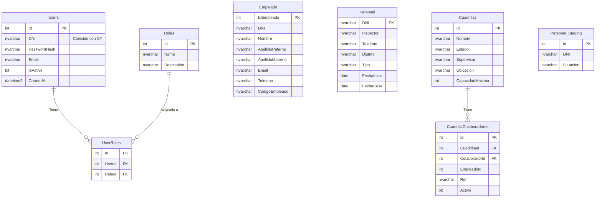

# Diagrama de Alineación de Base de Datos

Este diagrama representa la estructura actual de la base de datos `DB_Operation` y su alineación con el código C#.

## Notas de Alineación Detectadas

1.  **Users / Roles / UserRoles**:
    *   ✅ **Alineado**. El código C# ha sido actualizado para usar `DNI`.

2.  **Cuadrillas**:
    *   ✅ **Alineado**. Coincide con la entidad `Cuadrilla`.

3.  **Colaboradores (C#) vs DB**:
    *   ⚠️ **Desalineado**.
    *   En C# existe la entidad `Colaborador` que espera una tabla `Colaboradores`.
    *   **En la BD NO existe la tabla `Colaboradores`.**
    *   En la BD existen `Empleado` y `Personal`.
    *   La tabla `CuadrillaColaboradores` tiene columnas `ColaboradorId` y `EmpleadoId`. Esto sugiere una ambigüedad en la relación.

4.  **Empleado (C#)**:
    *   ✅ **Alineado**. Mapeado explícitamente a la tabla `Empleado`.
