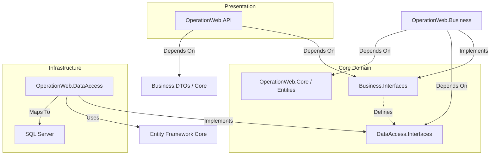

# Architecture Diagram: OperationWeb System

## 🏛️ High-Level Overview (Clean Architecture)

The system strictly follows **Clean Architecture** principles, ensuring separation of concerns and dependency inversion.

## 🔄 Dependency Flow Analysis
1. **API (Presentation)**: Knows ONLY about interfaces (`IUserService`) and DTOs. It does NOT know about `DbContext` or SQL.
2. **Business (Application)**: Contains pure C# logic. Orchestrates data flow. Depends on `IRepository`, not `EfRepository`.
3. **DataAccess (Infrastructure)**: The only layer that touches `Microsoft.EntityFrameworkCore`. It is plugged in via Dependency Injection in `Program.cs`.

## 🛡️ TOGAF Phase C Alignment
- **Domain**: `OperationWeb.Core/Entities` & `Business.Interfaces`.
- **Application**: `OperationWeb.Business` (Services).
- **Infrastructure**: `OperationWeb.DataAccess` (Repositories).

## ✅ Audit Result
- **Coupling**: Loose (via Interfaces).
- **Database Agnostic**: Yes (Logic layer doesn't derive from EF classes).
- **Testability**: High (Services can be unit tested with Moq).
