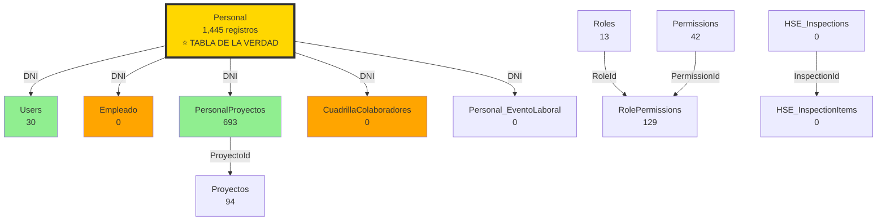
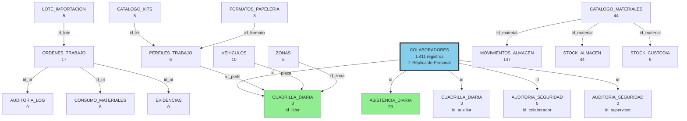
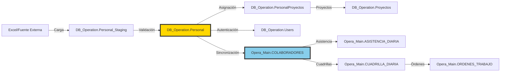

# 🗄️ REPORTE DE AUDITORÍA - RELACIONES DE BASES DE DATOS

**Fecha:** 2026-02-05  
**Agente:** DB-Master (Agente 2)  
**Servidor:** Toshiba (100.125.169.14)  
**Objetivo:** Auditoría completa de `DB_Operation` y `Opera_Main` con `Personal` como tabla de la verdad

---

## 📋 RESUMEN EJECUTIVO

Se realizó una auditoría completa de las bases de datos `DB_Operation` y `Opera_Main`, identificando todas las tablas, sus relaciones (Foreign Keys), y el flujo de datos entre ellas.

### 🎯 Hallazgo Principal

**`DB_Operation.Personal` es la TABLA DE LA VERDAD**

- **1,445 registros** en `DB_Operation.Personal`
- **1,411 registros** en `Opera_Main.COLABORADORES`
- **Diferencia:** 34 registros (2.35%) solo existen en `Personal`

---

## 📊 COMPARATIVA DE BASES DE DATOS

| Aspecto | DB_Operation | Opera_Main |
|:---|:---|:---|
| **Total de tablas** | 25 | 24 |
| **Foreign Keys** | 9 | 17 |
| **Tabla central** | `Personal` (1,445) | `COLABORADORES` (1,411) |
| **Propósito** | Identidad, Autenticación, Proyectos | Operaciones, Asistencia, Logística |

---

## 🗂️ INVENTARIO DE TABLAS

### DB_Operation (25 tablas)

#### 🔐 Módulo de Identidad y Autenticación
| Tabla | Registros | Descripción |
|:---|---:|:---|
| `Personal` | **1,445** | ⭐ **TABLA DE LA VERDAD** - Maestro de colaboradores |
| `Users` | 30 | Usuarios del sistema (FK → Personal.DNI) |
| `Roles` | 13 | Roles de usuario |
| `Permissions` | 42 | Permisos del sistema |
| `RolePermissions` | 129 | Relación Roles-Permisos |
| `UserRoles` | 3 | Relación Usuarios-Roles |
| `UserAccessConfigs` | 30 | Configuraciones de acceso |
| `UserActivations` | 0 | Activaciones de usuario |
| `PasswordResetTokens` | 19 | Tokens de recuperación de contraseña |

#### 📁 Módulo de Proyectos
| Tabla | Registros | Descripción |
|:---|---:|:---|
| `Proyectos` | 94 | Proyectos del sistema |
| `PersonalProyectos` | 693 | Asignación Personal-Proyectos (FK → Personal.DNI) |

#### 👷 Módulo de Operaciones
| Tabla | Registros | Descripción |
|:---|---:|:---|
| `Empleado` | 0 | Empleados (FK → Personal.DNI) |
| `Cuadrillas` | 0 | Cuadrillas de trabajo |
| `CuadrillaColaboradores` | 0 | Relación Cuadrillas-Personal (FK → Personal.DNI) |

#### 🛡️ Módulo HSE (Health, Safety, Environment)
| Tabla | Registros | Descripción |
|:---|---:|:---|
| `HSE_Inspections` | 0 | Inspecciones de seguridad |
| `HSE_InspectionItems` | 0 | Ítems de inspección |
| `HSE_Incidents` | 0 | Incidentes de seguridad |
| `HSE_PPE_Delivery` | 0 | Entrega de EPP |

#### 📥 Módulo de Staging
| Tabla | Registros | Descripción |
|:---|---:|:---|
| `Personal_Staging` | 0 | Área de staging para carga de Personal |
| `Personal_EventoLaboral` | 0 | Eventos laborales (FK → Personal.DNI) |
| `Historial_Cargas_Personal` | 16 | Historial de cargas de Personal |

#### ⚙️ Módulo de Sistema
| Tabla | Registros | Descripción |
|:---|---:|:---|
| `SystemSettings` | 5 | Configuraciones del sistema |
| `MotivosCese` | 0 | Motivos de cese laboral |
| `__EFMigrationsHistory` | 7 | Historial de migraciones EF |
| `sysdiagrams` | 0 | Diagramas del sistema |

---

### Opera_Main (24 tablas)

#### 👥 Módulo de Colaboradores
| Tabla | Registros | Descripción |
|:---|---:|:---|
| `COLABORADORES` | **1,411** | ⭐ Réplica de Personal (sincronizada) |
| `COLABORADORES_BACKUP_20251223` | 21 | Backup de colaboradores |
| `ASISTENCIA_DIARIA` | 53 | Asistencia diaria (FK → COLABORADORES.id) |
| `v_Global_Personal` | - | Vista a DB_Operation.Personal |

#### 🚧 Módulo de Operaciones de Campo
| Tabla | Registros | Descripción |
|:---|---:|:---|
| `ORDENES_TRABAJO` | 17 | Órdenes de trabajo |
| `CUADRILLA_DIARIA` | 3 | Cuadrillas diarias (FK → COLABORADORES) |
| `PERFILES_TRABAJO` | 6 | Perfiles de trabajo |
| `ZONAS` | 5 | Zonas de trabajo |

#### 📦 Módulo de Logística
| Tabla | Registros | Descripción |
|:---|---:|:---|
| `CATALOGO_MATERIALES` | 44 | Catálogo de materiales |
| `CATALOGO_KITS` | 5 | Catálogo de kits |
| `STOCK_ALMACEN` | 44 | Stock en almacén |
| `STOCK_CUSTODIA` | 9 | Stock en custodia |
| `MOVIMIENTOS_ALMACEN` | 147 | Movimientos de almacén |
| `CONSUMO_MATERIALES` | 8 | Consumo de materiales |
| `FORMATOS_PAPELERIA` | 3 | Formatos de papelería |

#### 🚗 Módulo de Vehículos
| Tabla | Registros | Descripción |
|:---|---:|:---|
| `VEHICULOS` | 10 | Vehículos |
| `VEHICLE_TRACKING_LOGS` | 14 | Logs de tracking vehicular |
| `REGISTRO_VEHICULAR` | 0 | Registro vehicular |

#### 📊 Módulo de Importación y Valorización
| Tabla | Registros | Descripción |
|:---|---:|:---|
| `LOTE_IMPORTACION` | 5 | Lotes de importación |
| `LOTE_VALORIZACION` | 4 | Lotes de valorización |

#### 🔍 Módulo de Auditoría
| Tabla | Registros | Descripción |
|:---|---:|:---|
| `AUDITORIA_LOG` | 0 | Log de auditoría |
| `AUDITORIA_SEGURIDAD` | 0 | Auditoría de seguridad |
| `EVIDENCIAS` | 0 | Evidencias |
| `INCIDENTES` | 15 | Incidentes |

#### ⚙️ Sistema
| Tabla | Registros | Descripción |
|:---|---:|:---|
| `sysdiagrams` | 0 | Diagramas del sistema |

---

## 🔗 MAPA DE RELACIONES (FOREIGN KEYS)

### DB_Operation - Relaciones centradas en `Personal`



**Total Foreign Keys en DB_Operation:** 9

| Tabla Hija | Columna | Tabla Padre | Columna Referenciada |
|:---|:---|:---|:---|
| `Users` | DNI | `Personal` | DNI |
| `Empleado` | DNI | `Personal` | DNI |
| `PersonalProyectos` | DNI | `Personal` | DNI |
| `PersonalProyectos` | ProyectoId | `Proyectos` | Id |
| `CuadrillaColaboradores` | PersonalDNI | `Personal` | DNI |
| `Personal_EventoLaboral` | DNI | `Personal` | DNI |
| `RolePermissions` | RoleId | `Roles` | Id |
| `RolePermissions` | PermissionId | `Permissions` | Id |
| `HSE_InspectionItems` | InspectionId | `HSE_Inspections` | Id |

---

### Opera_Main - Relaciones centradas en `COLABORADORES`



**Total Foreign Keys en Opera_Main:** 17

---

## 🔄 FLUJO DE DATOS Y SINCRONIZACIÓN

### 1. Personal → COLABORADORES (Sincronización Principal)

```
DB_Operation.Personal (1,445)  ──sync──>  Opera_Main.COLABORADORES (1,411)
         ⭐ FUENTE DE VERDAD                      ⭐ RÉPLICA OPERACIONAL
```

**Diferencia:** 34 registros (2.35%) existen solo en `Personal`

**Campos clave sincronizados:**
- `DNI` (clave primaria lógica)
- `Inspector` (nombre completo)
- `Telefono`
- `Correo`
- `Cargo`
- `Estado`
- `photo_url` (solo en COLABORADORES)

---

### 2. Referencias por DNI

#### En DB_Operation (Personal como fuente)

| Tabla | Campo DNI | Longitud | Uso |
|:---|:---|:---|:---|
| `Personal` | DNI | NVARCHAR(40) | ⭐ Clave primaria |
| `Users` | DNI | NVARCHAR(40) | FK → Personal |
| `Empleado` | DNI | NVARCHAR(40) | FK → Personal |
| `PersonalProyectos` | DNI | NVARCHAR(40) | FK → Personal |
| `CuadrillaColaboradores` | PersonalDNI | NVARCHAR(40) | FK → Personal |
| `Personal_EventoLaboral` | DNI | NVARCHAR(40) | FK → Personal |
| `Proyectos` | GerenteDni | NVARCHAR(80) | Referencia implícita |
| `Proyectos` | JefeDni | NVARCHAR(80) | Referencia implícita |

#### En Opera_Main (COLABORADORES como réplica)

| Tabla | Campo DNI | Longitud | Uso |
|:---|:---|:---|:---|
| `COLABORADORES` | dni | NVARCHAR(80) | Clave lógica |
| `ASISTENCIA_DIARIA` | dni_colaborador | NVARCHAR(80) | Referencia implícita |
| `v_Global_Personal` | DNI | NVARCHAR(40) | Vista a DB_Operation.Personal |

---

### 3. Flujo de Operaciones



---

## 📌 TABLAS QUE DEPENDEN DE `Personal`

### Dependencias Directas (con Foreign Key)

| Tabla | Registros | Relación | Estado |
|:---|---:|:---|:---|
| `Users` | 30 | FK → Personal.DNI | ✅ Activo |
| `PersonalProyectos` | 693 | FK → Personal.DNI | ✅ Activo |
| `Empleado` | 0 | FK → Personal.DNI | ⚠️ Vacío |
| `CuadrillaColaboradores` | 0 | FK → Personal.DNI | ⚠️ Vacío |
| `Personal_EventoLaboral` | 0 | FK → Personal.DNI | ⚠️ Vacío |

### Dependencias Implícitas (sin Foreign Key formal)

| Tabla | Campo | Relación |
|:---|:---|:---|
| `Proyectos` | GerenteDni | Referencia implícita a Personal.DNI |
| `Proyectos` | JefeDni | Referencia implícita a Personal.DNI |
| `HSE_Incidents` | ReporterDNI | Referencia implícita a Personal.DNI |
| `HSE_Inspections` | InspectorDNI | Referencia implícita a Personal.DNI |
| `HSE_PPE_Delivery` | WorkerDNI, DelivererDNI | Referencia implícita a Personal.DNI |
| `PasswordResetTokens` | DNI | Referencia implícita a Personal.DNI |
| `UserActivations` | DNI | Referencia implícita a Personal.DNI |

---

## 🚨 HALLAZGOS Y RECOMENDACIONES

### Hallazgo 1: Desincronización Personal ↔ COLABORADORES

> [!WARNING]
> **DESINCRONIZACIÓN DETECTADA**
> 
> - `DB_Operation.Personal`: **1,445 registros**
> - `Opera_Main.COLABORADORES`: **1,411 registros**
> - **Diferencia:** 34 registros (2.35%)
> 
> **Recomendación:** Implementar proceso de sincronización automática o identificar si los 34 registros son inactivos/históricos.

---

### Hallazgo 2: Inconsistencia en Longitud de DNI

> [!CAUTION]
> **LONGITUDES DE DNI INCONSISTENTES**
> 
> | Base de Datos | Tabla | Longitud DNI |
> |:---|:---|:---|
> | DB_Operation | Personal | NVARCHAR(40) |
> | DB_Operation | Proyectos.GerenteDni | NVARCHAR(80) |
> | Opera_Main | COLABORADORES | NVARCHAR(80) |
> | Opera_Main | ASISTENCIA_DIARIA | NVARCHAR(80) |
> 
> **Recomendación:** Estandarizar a NVARCHAR(80) en todas las tablas para evitar truncamiento.

---

### Hallazgo 3: Tablas Vacías con Foreign Keys

> [!NOTE]
> **TABLAS VACÍAS EN DB_Operation**
> 
> Las siguientes tablas tienen Foreign Keys a `Personal` pero están vacías:
> - `Empleado` (0 registros)
> - `CuadrillaColaboradores` (0 registros)
> - `Personal_EventoLaboral` (0 registros)
> - Módulo HSE completo (0 registros)
> 
> **Recomendación:** Evaluar si estas tablas son legacy o están pendientes de implementación.

---

### Hallazgo 4: Vista `v_Global_Personal`

> [!IMPORTANT]
> **VISTA CROSS-DATABASE DETECTADA**
> 
> `Opera_Main.v_Global_Personal` es una vista que apunta a `DB_Operation.Personal`.
> 
> **Ventaja:** Acceso directo a la fuente de verdad desde Opera_Main  
> **Riesgo:** Dependencia cross-database puede afectar performance
> 
> **Recomendación:** Usar esta vista para consultas de solo lectura, no para operaciones transaccionales.

---

## 📊 ESTADÍSTICAS DE INTEGRIDAD

### Cobertura de Foreign Keys

| Base de Datos | Tablas con FK | Total Tablas | Cobertura |
|:---|---:|---:|:---|
| DB_Operation | 9 | 25 | 36% |
| Opera_Main | 17 | 24 | 71% |

### Tablas con Datos

| Base de Datos | Tablas con datos | Total Tablas | Porcentaje |
|:---|---:|---:|:---|
| DB_Operation | 13 | 25 | 52% |
| Opera_Main | 18 | 24 | 75% |

---

## ✅ CONCLUSIONES

1. **`DB_Operation.Personal` es la TABLA DE LA VERDAD** ✅
   - 1,445 registros
   - 5 Foreign Keys directas
   - 7 referencias implícitas

2. **`Opera_Main.COLABORADORES` es la RÉPLICA OPERACIONAL** ✅
   - 1,411 registros (97.65% de Personal)
   - Centro de 5 Foreign Keys en Opera_Main
   - Usada para operaciones de campo

3. **Flujo de datos es unidireccional** ✅
   - Personal → COLABORADORES (sincronización)
   - No hay escritura de Opera_Main a DB_Operation

4. **Existen inconsistencias menores** ⚠️
   - 34 registros de diferencia
   - Longitudes de DNI inconsistentes
   - Tablas vacías con FK definidas

---

## 📎 ARCHIVOS GENERADOS

- **Script de auditoría:** [audit_database_relationships.py](file:///Users/josearbildocuellar/Documents/Desarrollo_SGO/Workspace_DB/tools/db_admin/audit_database_relationships.py)
- **Resultados JSON:** `database_audit_results.json`

---

**Estado:** ✅ **AUDITORÍA COMPLETADA**  
**Próximo paso:** Implementar sincronización automática Personal ↔ COLABORADORES
