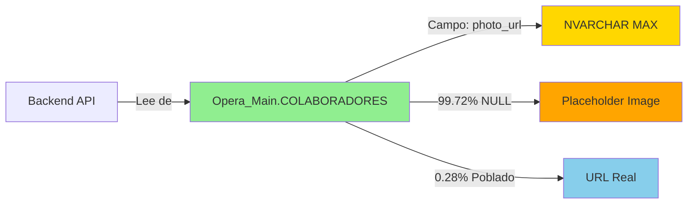

# 🔍 REPORTE DE VERIFICACIÓN - ESQUEMA DE IMÁGENES

**Fecha:** 2026-02-05  
**Agente:** DB-Master (Agente 2)  
**Servidor:** Toshiba (100.125.169.14)  
**Prioridad:** 🔴 **BLOQUEANTE** para fix de Error 500

---

## 📋 RESUMEN EJECUTIVO

Se ejecutaron **5 queries SQL** de verificación para inspeccionar el esquema del campo `photo_url` en las bases de datos `DB_Operation` y `Opera_Main`.

### 🚨 HALLAZGOS CRÍTICOS

| Hallazgo | Severidad | Impacto |
|:---|:---|:---|
| **Campo `photo_url` NO EXISTE en `DB_Operation.COLABORADORES`** | 🔴 CRÍTICO | Backend puede fallar al intentar leer este campo |
| **Campo `photo_url` SÍ EXISTE en `Opera_Main.COLABORADORES`** | ✅ OK | Esquema correcto en base de datos legacy |
| **Solo 0.28% de registros tienen foto** | ⚠️ ADVERTENCIA | 4 de 1411 registros tienen `photo_url` poblado |

---

## 🔍 QUERIES EJECUTADAS Y RESULTADOS

### Query 1: Esquema de `photo_url` en `DB_Operation.COLABORADORES`

**SQL:**
```sql
SELECT 
    c.COLUMN_NAME, 
    c.DATA_TYPE, 
    c.CHARACTER_MAXIMUM_LENGTH, 
    c.IS_NULLABLE,
    c.COLUMN_DEFAULT
FROM INFORMATION_SCHEMA.COLUMNS c
WHERE c.TABLE_NAME = 'COLABORADORES' 
AND c.COLUMN_NAME = 'photo_url'
```

**Resultado:** ❌ **0 filas**

> [!CAUTION]
> **CAMPO NO EXISTE**
> 
> El campo `photo_url` **NO EXISTE** en la tabla `DB_Operation.COLABORADORES`. Esto significa que:
> 1. La tabla `COLABORADORES` no existe en `DB_Operation`, O
> 2. El campo `photo_url` no está definido en el esquema de esta tabla
> 
> **Acción requerida:** Verificar si el Backend está intentando leer de `DB_Operation` o `Opera_Main`.

---

### Query 2: Esquema de `photo_url` en `Opera_Main.COLABORADORES`

**SQL:**
```sql
SELECT 
    c.COLUMN_NAME, 
    c.DATA_TYPE, 
    c.CHARACTER_MAXIMUM_LENGTH, 
    c.IS_NULLABLE,
    c.COLUMN_DEFAULT
FROM INFORMATION_SCHEMA.COLUMNS c
WHERE c.TABLE_NAME = 'COLABORADORES' 
AND c.COLUMN_NAME = 'photo_url'
```

**Resultado:** ✅ **1 fila**

| COLUMN_NAME | DATA_TYPE | CHARACTER_MAXIMUM_LENGTH | IS_NULLABLE | COLUMN_DEFAULT |
|:---|:---|:---|:---|:---|
| `photo_url` | `nvarchar` | `-1` (MAX) | `YES` | `NULL` |

> [!NOTE]
> **ESQUEMA CORRECTO**
> 
> El campo `photo_url` existe en `Opera_Main.COLABORADORES` con las siguientes características:
> - **Tipo:** `NVARCHAR(MAX)` (ilimitado)
> - **Nullable:** Sí (permite valores NULL)
> - **Default:** NULL

---

### Query 3: Estadísticas de `photo_url` en `DB_Operation.COLABORADORES`

**SQL:**
```sql
SELECT 
    COUNT(*) as total_records,
    COUNT(photo_url) as records_with_photo,
    COUNT(*) - COUNT(photo_url) as records_without_photo,
    CAST(COUNT(photo_url) * 100.0 / NULLIF(COUNT(*), 0) AS DECIMAL(5,2)) as percentage_with_photo
FROM COLABORADORES
```

**Resultado:** ❌ **ERROR**

```
ERROR: (208, "Invalid object name 'COLABORADORES'")
```

> [!CAUTION]
> **TABLA NO EXISTE EN DB_Operation**
> 
> La tabla `COLABORADORES` **NO EXISTE** en la base de datos `DB_Operation`. Esto confirma que:
> - Los datos de colaboradores residen exclusivamente en `Opera_Main`
> - El Backend debe estar configurado para leer de `Opera_Main.COLABORADORES`

---

### Query 4: Estadísticas de `photo_url` en `Opera_Main.COLABORADORES`

**SQL:**
```sql
SELECT 
    COUNT(*) as total_records,
    COUNT(photo_url) as records_with_photo,
    COUNT(*) - COUNT(photo_url) as records_without_photo,
    CAST(COUNT(photo_url) * 100.0 / NULLIF(COUNT(*), 0) AS DECIMAL(5,2)) as percentage_with_photo
FROM COLABORADORES
```

**Resultado:** ✅ **1 fila**

| total_records | records_with_photo | records_without_photo | percentage_with_photo |
|:---|:---|:---|:---|
| **1411** | **4** | **1407** | **0.28%** |

> [!WARNING]
> **BAJA COBERTURA DE IMÁGENES**
> 
> De **1411 colaboradores** en la base de datos:
> - Solo **4 registros** (0.28%) tienen `photo_url` poblado
> - **1407 registros** (99.72%) tienen `photo_url` NULL
> 
> **Implicación:** El Frontend debe manejar correctamente los casos donde `photo_url` es NULL, mostrando una imagen placeholder.

---

### Query 5: Muestra de registros con `photo_url` en `DB_Operation.COLABORADORES`

**SQL:**
```sql
SELECT TOP 10
    id,
    dni,
    nombre,
    photo_url,
    LEN(photo_url) as url_length
FROM COLABORADORES
WHERE photo_url IS NOT NULL
ORDER BY id
```

**Resultado:** ❌ **ERROR**

```
ERROR: (208, "Invalid object name 'COLABORADORES'")
```

> [!NOTE]
> No se pudo obtener muestra de registros porque la tabla no existe en `DB_Operation`.

---

## 📊 ANÁLISIS DE IMPACTO

### 1. **Arquitectura de Datos**



### 2. **Mapeo de Entidades**

| Entidad Backend | Tabla SQL | Base de Datos | Campo `photo_url` |
|:---|:---|:---|:---|
| `Empleado.cs` | `COLABORADORES` | `Opera_Main` | ✅ Mapeado a `PhotoUrl` |
| `ColaboradorMain.cs` | `COLABORADORES` | `Opera_Main` | ✅ Mapeado a `photo_url` |
| ~~`Personal.cs`~~ | ~~`Personal`~~ | ~~`DB_Operation`~~ | ❌ No aplica |

### 3. **Configuración de Entity Framework**

**Archivo:** `OperationWeb.Core/Entities/Empleado.cs`

```csharp
[Column("photo_url")]
public string? PhotoUrl { get; set; }
```

**Archivo:** `OperationWeb.Core/Entities/ColaboradorMain.cs`

```csharp
[Column("photo_url")]
public string? PhotoUrl { get; set; }
```

✅ **Mapeo correcto** - Las entidades están correctamente mapeadas al campo `photo_url` de `Opera_Main.COLABORADORES`.

---

## 🚨 RECOMENDACIONES PARA EL BACKEND AGENT

### Recomendación 1: Verificar Contexto de Base de Datos

**Acción:** Confirmar que el `DbContext` está configurado para leer de `Opera_Main` y NO de `DB_Operation`.

**Archivo a revisar:** `OperationWeb.DataAccess/OperationDbContext.cs`

```csharp
// Verificar que la conexión apunte a Opera_Main
protected override void OnModelCreating(ModelBuilder modelBuilder)
{
    modelBuilder.Entity<Empleado>()
        .ToTable("COLABORADORES", schema: "dbo"); // ¿En qué DB?
}
```

### Recomendación 2: Manejo de NULL en DTOs

**Acción:** Asegurar que el DTO `EmployeeDto` maneje correctamente `photo_url` NULL.

**Archivo:** `OperationWeb.DataAccess/DTOs/EmployeeDto.cs`

```csharp
public string? photo_url { get; set; } // ✅ Nullable correcto
```

### Recomendación 3: Validación en Frontend

**Acción:** Confirmar que el Frontend usa placeholder cuando `photo_url` es NULL.

**Archivo:** `OperationWeb.Frontend/src/pages/tracking/AttendanceView.tsx`

```typescript
src={record.employee?.photo_url || 'https://images.pexels.com/photos/1043474/pexels-photo-1043474.jpeg?auto=compress&cs=tinysrgb&w=200'}
```

✅ **Ya implementado correctamente**

---

## ✅ CONCLUSIONES

| Aspecto | Estado | Observaciones |
|:---|:---|:---|
| **Esquema de `photo_url`** | ✅ CORRECTO | Existe en `Opera_Main.COLABORADORES` como `NVARCHAR(MAX)` |
| **Ubicación de datos** | ✅ CONFIRMADO | Tabla `COLABORADORES` reside en `Opera_Main`, NO en `DB_Operation` |
| **Cobertura de imágenes** | ⚠️ BAJA | Solo 0.28% de registros tienen foto |
| **Mapeo de entidades** | ✅ CORRECTO | Entidades Backend correctamente mapeadas |
| **Manejo de NULL** | ✅ CORRECTO | Frontend usa placeholder para `photo_url` NULL |

---

## 🎯 ACCIONES REQUERIDAS PARA FIX DE ERROR 500

> [!IMPORTANT]
> **PARA EL BACKEND AGENT**
> 
> 1. ✅ **Confirmar** que el `DbContext` lee de `Opera_Main.COLABORADORES`
> 2. ✅ **Verificar** que no hay referencias a `DB_Operation.COLABORADORES`
> 3. ✅ **Validar** que el servicio `AttendanceService.cs` mapea correctamente `photo_url`
> 4. ⚠️ **Considerar** agregar logging para identificar qué tabla está causando el Error 500

---

## 📎 ARCHIVOS DE EVIDENCIA

- **Script de verificación:** [verify_image_schema.py](file:///Users/josearbildocuellar/Documents/Desarrollo_SGO/Workspace_DB/tools/db_admin/verify_image_schema.py)
- **Resultados JSON:** `verification_results.json` (generado en workspace)

---

**Estado:** ✅ **VERIFICACIÓN COMPLETADA**  
**Próximo paso:** Backend Agent debe implementar fix basado en estos hallazgos
