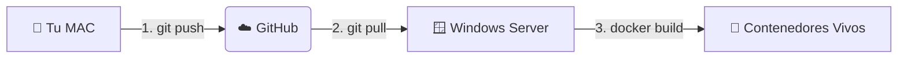

# 🗺️ Arquitectura del Sistema: Mapeo Definitivo

Este documento detalla la infraestructura, el flujo de despliegue y la conectividad del proyecto. Sirve como referencia para entender cómo interactúan los entornos locales y de producción.

## 1. Los Dos Entornos (The Two Worlds)

### 🍏 ENTURNO LOCAL (Tu Mac)
*   **Rol:** "El Arquitecto" (Desarrollo).
*   **Función:** Aquí reside el código fuente "abierto". Se editan los archivos `.cs`, `.ts`, y se realizan pruebas unitarias o de integración local.
*   **Estado:** Los cambios aquí son estáticos hasta que se envían. Es el plano de la obra.
*   **Herramientas:** VS Code, Git, Docker Desktop (opcional para pruebas).

### 🪟 ENTORNO PRODUCCIÓN (Windows Server)
*   **Rol:** "La Fábrica" (Ejecución).
*   **Función:** Aquí se ejecuta la aplicación real que utilizan los empleados. No se edita código; se despliegan contenedores.
*   **Estado:** Entorno vivo. Utiliza Docker para orquestar los servicios.
*   **Herramientas:** Docker Engine, PowerShell, Cloudflare Tunnel (`cloudflared`).

---

## 2. El Pipeline de Despliegue (The Bridge)

El flujo de cambios desde la Mac hasta el Servidor no es directo; utiliza **GitHub** como intermediario seguro.



### Pasos del Ciclo de Vida:
1.  **Edición (Mac)**: Se realizan correcciones o mejoras en el código.
2.  **Sincronización (Push)**: Se suben los cambios al repositorio central en GitHub.
3.  **Descarga (Pull - Server)**: El Agente del Servidor baja la última versión del código.
4.  **Construcción (Build - Server)**: Docker compila el código y crea los contenedores (`api` y `frontend`).
    *   *Nota Crítica:* Se debe usar `--no-cache` o `docker system prune` para asegurar que Docker no reutilice versiones viejas del código.

---

## 3. Conectividad y Acceso Externo (Cloudflare)

Dado que el Windows Server suele estar detrás de un firewall o en una red privada, utilizamos **Cloudflare Tunnels** para dar acceso seguro al mundo exterior sin abrir puertos peligrosos.

```mermaid
graph TD
    subgraph "🪟 Windows Server"
        Dock[🐳 Docker Compose]
        Dock -->|Levanta| API[⚙️ Motor (.NET API)]
        Dock -->|Levanta| Web[💻 Frontend (Vite/React)]
        
        API <-->|Red Interna Docker| Web
    end
    
    subgraph "🌍 Internet"
        User[👤 Usuario / Navegador]
        Movil[📱 App Android]
    end

    API -->|Túnel Seguro| CF[☁️ Cloudflare]
    Web -->|Túnel Seguro| CF
    
    CF -->|URL Pública https://...| User
    CF -->|URL Pública https://...| Movil
```

### Puntos Clave de la Red:
*   **URL Dinámica**: Cada vez que se reinicia el túnel, Cloudflare asigna una nueva URL pública (ej: `rotten-orange...trycloudflare.com`).
*   **Inyección Automática**: El script `start_operation_smart.ps1` detecta esta nueva URL y la inyecta automáticamente en la configuración del Frontend antes de construirlo, para que la Web sepa a dónde llamar a la API.
*   **Seguridad CORS**: El Backend (.NET) está configurado para confiar explícitamente en el origen del Frontend (Reflected Origin), permitiendo el paso de credenciales (cookies) a través del túnel.

---

## 4. Comandos de Mantenimiento (Cheat Sheet)

### En la Mac (Desarrollo):
*   `git push origin main`: Subir cambios a producción.
*   `npm run build`: Verificar que el frontend compila sin errores.

### En el Servidor (Producción - PowerShell):
*   `./start_operation_smart.ps1`: **El Botón Rojo**. Baja cambios, borra contenedores viejos, reconstruye todo y levanta los túneles.
*   `docker system prune -a -f --volumes`: **Limpieza Nuclear**. Borra todo rastro de versiones anteriores para asegurar una instalación limpia.
*   `git fetch origin main && git reset --hard origin/main`: **Forzar Sincronización**. Descarta cualquier cambio local en el servidor y se alinea exactamente con GitHub.
