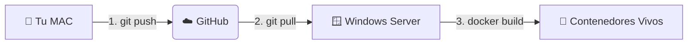

# 🗺️ Arquitectura del Sistema: Mapeo Definitivo

Este documento detalla la infraestructura, el flujo de despliegue y la conectividad del proyecto. Sirve como referencia para entender cómo interactúan los entornos locales y de producción.

## 1. Los Dos Entornos (The Two Worlds)

### 🍏 ENTURNO LOCAL (Tu Mac)
*   **Rol:** "El Arquitecto" (Desarrollo).
*   **Función:** Aquí reside el código fuente "abierto". Se editan los archivos `.cs`, `.ts`, y se realizan pruebas unitarias o de integración local.
*   **Estado:** Los cambios aquí son estáticos hasta que se envían. Es el plano de la obra.
*   **Herramientas:** VS Code, Git, Docker Desktop (opcional para pruebas).

### 🪟 ENTORNO PRODUCCIÓN (Windows Server)
*   **Rol:** "La Fábrica" (Ejecución).
*   **Función:** Aquí se ejecuta la aplicación real que utilizan los empleados. No se edita código; se despliegan contenedores.
*   **Estado:** Entorno vivo. Utiliza Docker para orquestar los servicios.
*   **Herramientas:** Docker Engine, PowerShell, Cloudflare Tunnel (`cloudflared`).

---

## 2. El Pipeline de Despliegue (The Bridge)

El flujo de cambios desde la Mac hasta el Servidor no es directo; utiliza **GitHub** como intermediario seguro.



### Pasos del Ciclo de Vida:
1.  **Edición (Mac)**: Se realizan correcciones o mejoras en el código.
2.  **Sincronización (Push)**: Se suben los cambios al repositorio central en GitHub.
3.  **Descarga (Pull - Server)**: El Agente del Servidor baja la última versión del código.
4.  **Construcción (Build - Server)**: Docker compila el código y crea los contenedores (`api` y `frontend`).
    *   *Nota Crítica:* Se debe usar `--no-cache` o `docker system prune` para asegurar que Docker no reutilice versiones viejas del código.

---

## 3. Conectividad y Acceso Externo (Cloudflare)

Dado que el Windows Server suele estar detrás de un firewall o en una red privada, utilizamos **Cloudflare Tunnels** para dar acceso seguro al mundo exterior sin abrir puertos peligrosos.

```mermaid
graph TD
    subgraph "🪟 Windows Server"
        Dock[🐳 Docker Compose]
        Dock -->|Levanta| API[⚙️ Motor (.NET API)]
        Dock -->|Levanta| Web[💻 Frontend (Vite/React)]
        
        API <-->|Red Interna Docker| Web
    end
    
    subgraph "🌍 Internet"
        User[👤 Usuario / Navegador]
        Movil[📱 App Android]
    end

    API -->|Túnel Seguro| CF[☁️ Cloudflare]
    Web -->|Túnel Seguro| CF
    
    CF -->|URL Pública https://...| User
    CF -->|URL Pública https://...| Movil
```

### Puntos Clave de la Red:
*   **URL Dinámica**: Cada vez que se reinicia el túnel, Cloudflare asigna una nueva URL pública (ej: `rotten-orange...trycloudflare.com`).
*   **Inyección Automática**: El script `start_operation_smart.ps1` detecta esta nueva URL y la inyecta automáticamente en la configuración del Frontend antes de construirlo, para que la Web sepa a dónde llamar a la API.
*   **Seguridad CORS**: El Backend (.NET) está configurado para confiar explícitamente en el origen del Frontend (Reflected Origin), permitiendo el paso de credenciales (cookies) a través del túnel.

---

## 4. Comandos de Mantenimiento (Cheat Sheet)

### En la Mac (Desarrollo):
*   `git push origin main`: Subir cambios a producción.
*   `npm run build`: Verificar que el frontend compila sin errores.

### En el Servidor (Producción - PowerShell):
*   `./start_operation_smart.ps1`: **El Botón Rojo**. Baja cambios, borra contenedores viejos, reconstruye todo y levanta los túneles.
*   `docker system prune -a -f --volumes`: **Limpieza Nuclear**. Borra todo rastro de versiones anteriores para asegurar una instalación limpia.
*   `git fetch origin main && git reset --hard origin/main`: **Forzar Sincronización**. Descarta cualquier cambio local en el servidor y se alinea exactamente con GitHub.

---

## 5. Ejecución Local en Mac (¿Cómo probar antes de subir?)

Aunque el destino final es Windows, tu Mac es un entorno de ejecución completo.

### Similitudes y Diferencias:
| Característica | Local (Mac) | Producción (Windows) |
| :--- | :--- | :--- |
| **Código Fuente** | El mismo (`/api/v1/...`) | El mismo (Sincronizado vía Git) |
| **Base de Datos** | InMemory (Volátil) o SQL Local | SQL Server (Persistente) |
| **URL Base** | `http://localhost:5132` | `https://...trycloudflare.com` |
| **CORS** | Refleja `localhost` | Refleja `...trycloudflare.com` |

### Pasos para Arrancar en Mac:
1.  **Backend**: Abra una terminal en `OperationWeb.API` y ejecute `dotnet run`.
    *   *Verificación:* Navegue a `http://localhost:5132/health`. Debe decir "Healthy".
2.  **Frontend**: Abra otra terminal en `OperationWeb.Frontend` y ejecute `npm run dev`.
    *   *Acceso:* Navegue a `http://localhost:5173`.
### Herramientas de Verificación en Mac:
*   **sqlcmd**: Herramienta de línea de comandos para consultar la base de datos directamente sin pasar por la API.
    *   Ejemplo: `/opt/homebrew/bin/sqlcmd -S 100.125.169.14 -U SA -P 'Password' -d DB_Operation -Q "SELECT TOP 5 * FROM Users"`
*   **Logs en tiempo real**: Al usar `dotnet run` y `npm run dev`, los errores aparecen instantáneamente en la terminal.

### Configuración Sensible (Local):
*   **appsettings.Development.json**: Este archivo es el más importante en la Mac. Contiene las credenciales reales para conectar a la base de datos de Tailscale. **NUNCA** debe subirse a producción (está en `.gitignore`).
*   **Identidad**: El sistema local utiliza la tabla `Users` de producción. Si no puedes loguearte localmente, probablemente es un problema de red (VPN) o de que el usuario no está marcado como `IsActive = 1`.

---

## 6. El Mundo del Servidor (Windows Production)

El servidor no es solo una máquina; es un ecosistema de contenedores aislados.

### Especificaciones Técnicas:
*   **SO**: Windows Server con Docker Engine.
*   **Orquestación**: Docker Compose.
*   **Red**: Los contenedores viven en una red interna privada. Solo son visibles al mundo a través de Cloudflare.

### El Corazón del Despliegue: `start_operation_smart.ps1`
Este script de PowerShell es el que "mueve los hilos" en producción. Realiza 4 acciones críticas:
1.  **Descubrimiento**: Pregunta a Cloudflare: *"¿En qué URL estás hoy?"*.
2.  **Sincronización**: Hace un `git reset --hard` para asegurar que el código es el de GitHub.
3.  **Inyección**: Escribe la URL oficial del Backend dentro del código del Frontend (`docker-compose.prod.yml`).
4.  **Ignición**: Ejecuta `docker-compose up --build --force-recreate` para levantar todo limpio.

### Gestión de Logs en el Servidor:
Para ver qué está pasando dentro del motor en la Windows Server:
*   `docker logs operation_backend -f`: Muestra el tráfico de la API en tiempo real.
*   `docker logs operation_frontend -f`: Muestra los logs del servidor web (Nginx/Vite).

---

## 7. Bitácora de Ajustes Arquitectónicos (Enero-Febrero 2026)

Para que el sistema funcione en local y producción sin errores, se aplicaron estos cambios estructurales:

### A. Unificación de Prefijos (Routing)
*   **Problema**: Había rutas mezcladas (`/api/auth`, `/api/v1/attendance`). El servidor bloqueaba las que no tenían `/v1/`.
*   **Solución**: Todas las rutas ahora nacen bajo `/api/v1/`.
*   **Archivos Clave**: `AuthController.cs`, `authService.ts`, `userService.ts`.

### B. CORS de Grado Industrial
*   **Problema**: El uso de comodines (`*`) bloquea el envío de cookies de seguridad (Cloudflare).
*   **Solución**: Se eliminó el middleware manual y se activó `AddCors` + `UseCors` con la política de **Reflexión dinámica**. El servidor ahora mira quién le habla y le da permiso solo a ese origen, permitiendo "Credentials".
*   **Archivos Clave**: `Program.cs`, `api.ts` (con `withCredentials: true`).

### C. Inyección Dinámica de URL
*   **Problema**: Las URLs de Cloudflare cambian en cada reinicio.
*   **Solución**: El script de despliegue captura la URL activa de la API y la inyecta quirúrgicamente en el Frontend antes de la compilación.
*   **Archivos Clave**: `start_operation_smart.ps1`, `docker-compose.prod.yml`.


