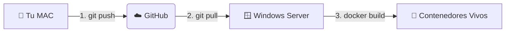
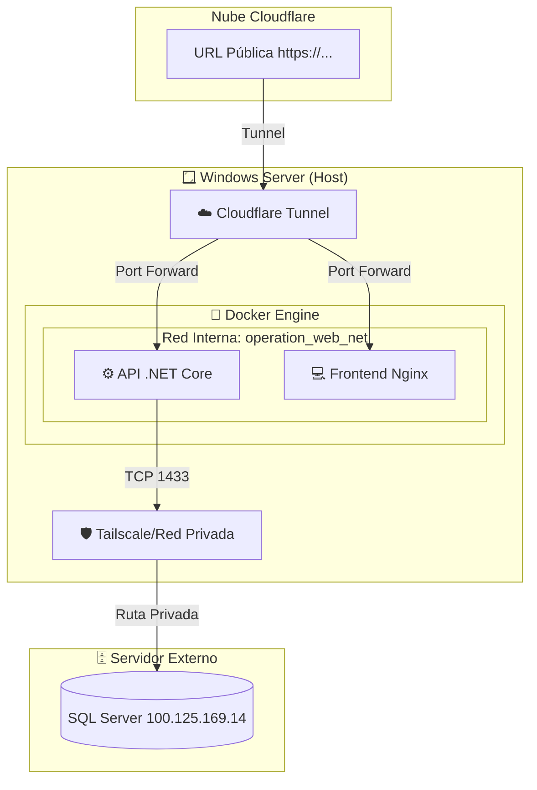
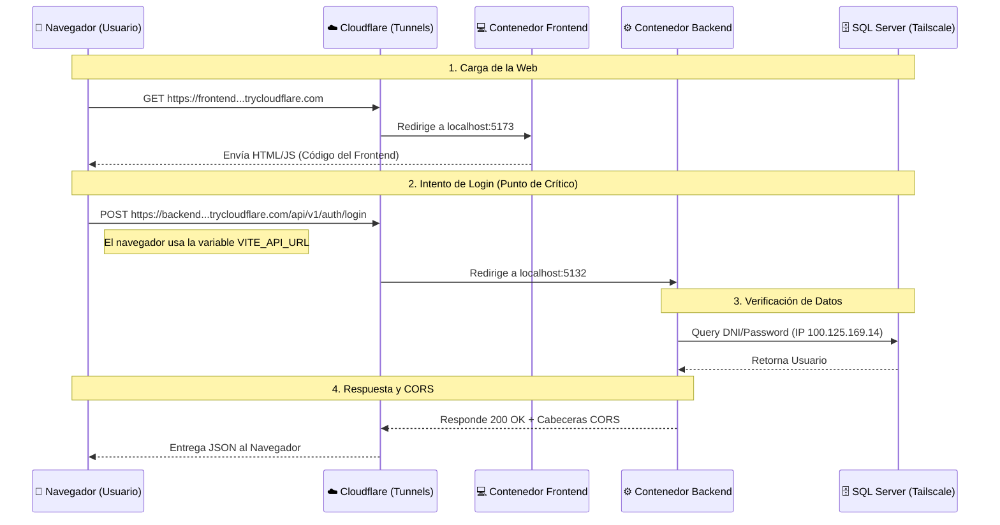

# 🗺️ Arquitectura del Sistema: Mapeo Definitivo

Este documento detalla la infraestructura, el flujo de despliegue y la conectividad del proyecto. Sirve como referencia para entender cómo interactúan los entornos locales y de producción.

## 1. Los Dos Entornos (The Two Worlds)

### 🍏 ENTURNO LOCAL (Tu Mac)
*   **Rol:** "El Arquitecto" (Desarrollo).
*   **Función:** Aquí reside el código fuente "abierto". Se editan los archivos `.cs`, `.ts`, y se realizan pruebas unitarias o de integración local.
*   **Estado:** Los cambios aquí son estáticos hasta que se envían. Es el plano de la obra.
*   **Herramientas:** VS Code, Git, Docker Desktop (opcional para pruebas).

### 🪟 ENTORNO PRODUCCIÓN (Windows Server)
*   **Rol:** "La Fábrica" (Ejecución).
*   **Función:** Aquí se ejecuta la aplicación real que utilizan los empleados. No se edita código; se despliegan contenedores.
*   **Estado:** Entorno vivo. Utiliza Docker para orquestar los servicios.
*   **Herramientas:** Docker Engine, PowerShell, Cloudflare Tunnel (`cloudflared`).

---

## 2. El Pipeline de Despliegue (The Bridge)

El flujo de cambios desde la Mac hasta el Servidor no es directo; utiliza **GitHub** como intermediario seguro.



### Pasos del Ciclo de Vida:
1.  **Edición (Mac)**: Se realizan correcciones o mejoras en el código.
2.  **Sincronización (Push)**: Se suben los cambios al repositorio central en GitHub.
3.  **Descarga (Pull - Server)**: El Agente del Servidor baja la última versión del código.
4.  **Construcción (Build - Server)**: Docker compila el código y crea los contenedores (`api` y `frontend`).
    *   *Nota Crítica:* Se debe usar `--no-cache` o `docker system prune` para asegurar que Docker no reutilice versiones viejas del código.

---

## 3. Conectividad y Acceso Externo (Cloudflare)

Dado que el Windows Server suele estar detrás de un firewall o en una red privada, utilizamos **Cloudflare Tunnels** para dar acceso seguro al mundo exterior sin abrir puertos peligrosos.

```mermaid
graph TD
    subgraph "🪟 Windows Server"
        Dock[🐳 Docker Compose]
        Dock -->|Levanta| API[⚙️ Motor (.NET API)]
        Dock -->|Levanta| Web[💻 Frontend (Vite/React)]
        
        API <-->|Red Interna Docker| Web
    end
    
    subgraph "🌍 Internet"
        User[👤 Usuario / Navegador]
        Movil[📱 App Android]
    end

    API -->|Túnel Seguro| CF[☁️ Cloudflare]
    Web -->|Túnel Seguro| CF
    
    CF -->|URL Pública https://...| User
    CF -->|URL Pública https://...| Movil
```

### Puntos Clave de la Red:
*   **URL Dinámica**: Cada vez que se reinicia el túnel, Cloudflare asigna una nueva URL pública (ej: `rotten-orange...trycloudflare.com`).
*   **Inyección Automática**: El script `start_operation_smart.ps1` detecta esta nueva URL y la inyecta automáticamente en la configuración del Frontend antes de construirlo, para que la Web sepa a dónde llamar a la API.
*   **Seguridad CORS**: El Backend (.NET) está configurado para confiar explícitamente en el origen del Frontend (Reflected Origin), permitiendo el paso de credenciales (cookies) a través del túnel.

---

## 4. Comandos de Mantenimiento (Cheat Sheet)

### En la Mac (Desarrollo):
*   `git push origin main`: Subir cambios a producción.
*   `npm run build`: Verificar que el frontend compila sin errores.

### En el Servidor (Producción - PowerShell):
*   `./start_operation_smart.ps1`: **El Botón Rojo**. Baja cambios, borra contenedores viejos, reconstruye todo y levanta los túneles.
*   `docker system prune -a -f --volumes`: **Limpieza Nuclear**. Borra todo rastro de versiones anteriores para asegurar una instalación limpia.
*   `git fetch origin main && git reset --hard origin/main`: **Forzar Sincronización**. Descarta cualquier cambio local en el servidor y se alinea exactamente con GitHub.

---

## 5. Ejecución Local en Mac (¿Cómo probar antes de subir?)

Aunque el destino final es Windows, tu Mac es un entorno de ejecución completo.

### Similitudes y Diferencias:
| Característica | Local (Mac) | Producción (Windows) |
| :--- | :--- | :--- |
| **Código Fuente** | El mismo (`/api/v1/...`) | El mismo (Sincronizado vía Git) |
| **Base de Datos** | InMemory (Volátil) o SQL Local | SQL Server (Persistente) |
| **URL Base** | `http://localhost:5132` | `https://...trycloudflare.com` |
| **CORS** | Refleja `localhost` | Refleja `...trycloudflare.com` |

### Pasos para Arrancar en Mac:
1.  **Backend**: Abra una terminal en `OperationWeb.API` y ejecute `dotnet run`.
    *   *Verificación:* Navegue a `http://localhost:5132/health`. Debe decir "Healthy".
2.  **Frontend**: Abra otra terminal en `OperationWeb.Frontend` y ejecute `npm run dev`.
    *   *Acceso:* Navegue a `http://localhost:5173`.
### Herramientas de Verificación en Mac:
*   **sqlcmd**: Herramienta de línea de comandos para consultar la base de datos directamente sin pasar por la API.
    *   Ejemplo: `/opt/homebrew/bin/sqlcmd -S 100.125.169.14 -U SA -P 'Password' -d DB_Operation -Q "SELECT TOP 5 * FROM Users"`
*   **Logs en tiempo real**: Al usar `dotnet run` y `npm run dev`, los errores aparecen instantáneamente en la terminal.

### Configuración Sensible (Local):
*   **appsettings.Development.json**: Este archivo es el más importante en la Mac. Contiene las credenciales reales para conectar a la base de datos de Tailscale. **NUNCA** debe subirse a producción (está en `.gitignore`).
*   **Identidad**: El sistema local utiliza la tabla `Users` de producción. Si no puedes loguearte localmente, probablemente es un problema de red (VPN) o de que el usuario no está marcado como `IsActive = 1`.

---

## 6. El Mundo del Servidor (Windows Production)

El servidor no es solo una máquina; es un ecosistema de contenedores aislados.

### Especificaciones Técnicas:
*   **SO**: Windows Server con Docker Engine.
*   **Orquestación**: Docker Compose.
*   **Red**: Los contenedores viven en una red interna privada. Solo son visibles al mundo a través de Cloudflare.

### El Corazón del Despliegue: `start_operation_smart.ps1`
Este script de PowerShell es el que "mueve los hilos" en producción. Realiza 4 acciones críticas:
1.  **Descubrimiento**: Pregunta a Cloudflare: *"¿En qué URL estás hoy?"*.
2.  **Inyección**: Escribe la URL oficial del Backend dentro del Frontend (`docker-compose.prod.yml`).
3.  **Ignición**: Ejecuta `docker compose build --no-cache` + `docker compose up -d`.
4.  **Verificación**: Valida `/health`, captcha, CORS y hardening de ruta legacy.

> Nota: el script **no** hace `git pull` ni `git reset`. La sincronización de código con `main` debe hacerse antes de ejecutarlo.

### Gestión de Logs en el Servidor:
Para ver qué está pasando dentro del motor en la Windows Server:
*   `docker logs operation_backend -f`: Muestra el tráfico de la API en tiempo real.
*   `docker logs operation_frontend -f`: Muestra los logs del servidor web (Nginx/Vite).

---

## 8. Deep Dive: Arquitectura Interna del Servidor (The Engine Room)

Esta sección explica cómo se "hablan" los componentes dentro de la Windows Server.

### A. La Red Interna de Docker (Docker Network)
Docker crea una red virtual privada (ej. `operation_web_network`) donde viven los contenedores.
*   **Visibilidad**: Los contenedores no conocen las IPs externas del servidor. Se hablan usando sus nombres de servicio:
    *   El Frontend busca a la API en: `http://operation_backend:5132` (internamente).
*   **Aislamiento**: Nada desde fuera puede entrar a esta red, excepto a través de las "puertas" que abrimos.

### B. El Ciclo de Cloudflare Tunnel (External Traffic)
El servidor corre dos procesos `cloudflared` (Túneles) que actúan como guardaespaldas:
1.  **Conexión de Salida**: El servidor se conecta a Cloudflare (no al revés). Esto salta cualquier Firewall.
2.  **Mapeo Dinámico**: 
    *   Túnel 1 -> Redirige tráfico a `http://localhost:5173` (Frontend).
    *   Túnel 2 -> Redirige tráfico a `http://localhost:5132` (Backend).
3.  **Identidad**: Cada túnel genera una URL tipo `.trycloudflare.com`.

> Nota operativa: `5173` corresponde al **modo Docker automatizado** (`start_operation_smart.ps1`).
> En contingencia/manual (sin frontend Docker), el frontend se sirve en `54416`.

### C. Capa de Datos: Conexión a SQL Server
El acceso a la base de datos `100.125.169.14` ocurre a nivel de la máquina física (Host).
*   **Ruta**: Contenedor Backend -> Puerta de Enlace Docker -> Red Tailscale -> SQL Server.
*   **Seguridad**: El servidor Windows debe estar logueado en Tailscale para que el contenedor pueda llegar a la IP `100.x.x.x`. Si Tailscale cae en el servidor, la App reportará "Error 500".




---

## 10. Mapeo de Flujo: El Triángulo de Producción (La Clave del Problema)

Para resolver los errores persistentes, es vital entender que la comunicación **no es interna entre contenedores**, sino que pasa por el navegador del usuario.

### El Triángulo de Comunicación:



### Por qué el Mapeo se rompe (Causas de Error):

1.  **VITE_API_URL Desactualizada**: 
    *   Si el Frontend se construye con una URL de backend vieja, el navegador del usuario llamará a un túnel muerto.
    *   *Mapeo Correcto*: Se inyecta en cada arranque vía `start_operation_smart.ps1`.

2.  **La Ilusión de "Red Interna"**:
    *   Muchos errores ocurren al creer que el Frontend y el Backend se hablan por IP interna de Docker. 
    *   *Realidad*: El Frontend (React) vive en el navegador del cliente. La red interna de Docker solo sirve para que el contenedor Nginx sirva los archivos estáticos. **Toda la lógica de API debe ser pública vía Cloudflare.**

3.  **CORS Reflected**:
    *   Como las URLs del Frontend y Backend son distintas, el navegador bloquea la comunicación a menos que el Backend "mapee" de vuelta el origen exacto del Frontend.

---

## 7. Bitácora de Ajustes Arquitectónicos (Enero-Febrero 2026)

Para que el sistema funcione en local y producción sin errores, se aplicaron estos cambios estructurales:

### A. Unificación de Prefijos (Routing)
*   **Problema**: Había rutas mezcladas (`/api/auth`, `/api/v1/attendance`). El servidor bloqueaba las que no tenían `/v1/`.
*   **Solución**: Todas las rutas ahora nacen bajo `/api/v1/`.
*   **Archivos Clave**: `AuthController.cs`, `authService.ts`, `userService.ts`.

### B. CORS de Grado Industrial
*   **Problema**: El uso de comodines (`*`) bloquea el envío de cookies de seguridad (Cloudflare).
*   **Solución**: Se eliminó el middleware manual y se activó `AddCors` + `UseCors` con la política de **Reflexión dinámica**. El servidor ahora mira quién le habla y le da permiso solo a ese origen, permitiendo "Credentials".
*   **Archivos Clave**: `Program.cs`, `api.ts` (con `withCredentials: true`).

---

## 9. Correlación de Errores y Diagnóstico (Troubleshooting)

Esta sección conecta los síntomas comunes con su causa raíz en la arquitectura.

### 🚩 Síntoma: `Access-Control-Allow-Origin: *` (CORS Wildcard)
*   **Correlación**: **Falla de Hardening / Prefijo de Ruta**.
*   **Causa**: El cliente está llamando a una ruta que **NO** empieza con `/api/v1/` (ej: `/api/auth/login`).
*   **Por qué ocurre**: El servidor está configurado para solo aceptar `/api/v1/`. Cualquier otra cosa cae en el "Muro de Seguridad 404" (Catch-all), el cual, por diseño, responde con un comodín (`*`) que invalida las credenciales.
*   **Solución**: Asegurar que en el Frontend el servicio use `/api/v1/`.

### 🚩 Síntoma: `Unexpected token <` (HTML en lugar de JSON)
*   **Correlación**: **Falla de Networking / Túnel**.
*   **Causa**: El Frontend está recibiendo una página de error 404 (HTML de Nginx o Cloudflare) en lugar del JSON de la API.
*   **Por qué ocurre**: La variable `VITE_API_URL` apunta a un túnel que está apagado o a una dirección que no existe, por lo que el proxy devuelve una página de "Not Found".
*   **Solución**: Verificar que el Túnel de la API esté arriba y que la URL en `docker-compose.prod.yml` sea la correcta.

### 🚩 Síntoma: `500 Internal Server Error` (Timeout)
*   **Correlación**: **Falla de Capa de Datos (Tailscale)**.
*   **Causa**: El motor (.NET) no puede hablar con el SQL Server en `100.125.169.14`.
*   **Por qué ocurre**: El servidor Windows ha perdido la conexión a Tailscale o el contenedor no tiene permiso para salir a la red privada.
*   **Solución**: Reiniciar Tailscale en el servidor y verificar que el SQL Server esté accesible.

### 🚩 Síntoma: `Login Error / Bad Request` (Captcha Fail)
*   **Correlación**: **Falla de Estado (Session/Token)**.
*   **Causa**: El servidor rechaza el captcha o el token de sesión.
*   **Por qué ocurre**: Generalmente es una consecuencia de los errores de CORS anteriores, donde el navegador bloquea las cookies de sesión, haciendo que el servidor crea que no hay un captcha válido activo.
*   **Solución**: Limpiar caché del navegador (Hard Refresh) y asegurar que el CORS sea el correctivo Industrial (Reflected Origin).

---

## 11. Lecciones del Incidente (12-Feb-2026) y Estado Real

Esta sección resume los hallazgos de producción ya verificados en campo para evitar repetir el mismo ciclo.

### A. Causa raíz observada (orden real de fallas)
1.  **Frontend compilado con `VITE_API_URL` inválido o placeholder** (`PEGA_AQUI_BACKEND_URL`) -> navegador rompe requests de auth.
2.  **Túneles Cloudflare desalineados** (frontend y backend con URLs de ejecuciones distintas) -> `ERR_NAME_NOT_RESOLVED` o `502/1033`.
3.  **Puerto frontend inestable** (`serve` cae a 58xxx cuando 54416 está ocupado) -> túnel apunta a puerto incorrecto.
4.  **Variables de entorno incompletas o placeholder** (`DB_CONNECTION_STRING`) -> backend levanta pero login falla por DB.
5.  **Sesión/caché del navegador stale** -> el usuario ve comportamiento viejo aunque backend ya esté corregido.

### B. Confirmaciones técnicas del entorno
1.  Endpoint correcto para captcha: `/api/v1/auth/captcha`.
2.  Ruta legacy `/api/auth/captcha` debe responder `404` (hardening esperado).
3.  CORS correcto: `Access-Control-Allow-Origin` refleja el frontend real y `Allow-Credentials=true`.
4.  Salud backend validable por `/health` con `200`.

### C. Ubicación oficial de runbook operativo
*   Documento operativo detallado: `docs/RUNBOOK_CAPTCHA_PRODUCTION.md`.
*   Script de automatización base: `start_operation_smart.ps1`.
*   Este archivo (`docs/SYSTEM_ARCHITECTURE.md`) define el contexto y los puntos de control.

### D. Para Docker y Antigravity: dónde mirar primero
1.  `docker-compose.prod.yml`:
    *   `VITE_API_URL` (build args + env)
    *   estado de servicios `api` / `frontend`
2.  Logs de túnel:
    *   `backend*.log`, `frontend*.log`
3.  Logs backend:
    *   `docker logs operation_backend --tail 200`
4.  Bundle frontend en runtime:
    *   revisar que contenga solo la URL backend activa y no placeholders.

---

## 12. Operación Estable (Modelo de 3 Terminales)

Este modelo es para **contingencia manual** (sin frontend Docker), y fue el que estabilizó el incidente cuando hubo múltiples terminales abiertas.
Para reducir confusión operativa, usar siempre el mismo patrón:

1.  **T1_BACKEND_TUNNEL**:
    *   Mantiene túnel backend `127.0.0.1:5132`.
2.  **T2_FRONTEND_SERVER**:
    *   `npm run build` + `npx serve -s dist -l 54416` (puerto fijo).
3.  **T3_FRONTEND_TUNNEL**:
    *   Mantiene túnel frontend `127.0.0.1:54416`.

Regla de oro:
*   Si `serve` no toma `54416`, liberar puerto y reiniciar antes de publicar URL.

---

## 13. Checklist de Alineación Total (Antes de cerrar jornada)

Objetivo: dejar todo consistente para que el sistema siga operativo y el próximo agente no herede estados ambiguos.

### A. Infraestructura y conectividad
1.  Backend URL activa capturada.
2.  Frontend URL activa capturada.
3.  `curl <backend>/health` = `200`.
4.  `curl <backend>/api/v1/auth/captcha` = `200`.
5.  `curl <backend>/api/auth/captcha` = `404`.

### B. Configuración
1.  `VITE_API_URL` en build frontend coincide con backend URL activa.
2.  `DB_CONNECTION_STRING` y `JWT_SECRET_KEY` definidos sin placeholders.
3.  Backend sin errores de autenticación SQL (`18456`) en logs.

### C. Navegador / UX
1.  Probar en incógnito (sin cache).
2.  Confirmar en consola:
    *   `[API] Connection BaseURL` apunta a backend real.
3.  Validar login completo:
    *   captcha visible en `/login`,
    *   navegación a dashboard sin errores críticos.

### D. Revisión general del proyecto (obligatoria)
Antes de terminar:
1.  Ejecutar revisión rápida de backend/frontend (build + endpoints críticos).
2.  Verificar que documentación y script operativo sigan alineados:
    *   `docs/SYSTEM_ARCHITECTURE.md`
    *   `docs/RUNBOOK_CAPTCHA_PRODUCTION.md`
    *   `start_operation_smart.ps1`
3.  Registrar cambios operativos en bitácora (`docs/SQUAD_CHANGELOG.md`) si hubo ajustes.

---

## 14. Hallazgos Finales de la Jornada (Incidente Captcha/Login)

### A. Qué quedó resuelto
1.  **Captcha** volvió a cargar correctamente con la ruta auditada `/api/v1/auth/captcha`.
2.  **CORS** quedó validado con mirror correcto (`Access-Control-Allow-Origin` = frontend activo).
3.  **Hardening** validado (`/api/auth/captcha` devuelve `404` por diseño).

### B. Qué causó los errores posteriores
1.  **`BaseURL` placeholder en frontend** (`PEGA_AQUI_BACKEND_URL`) por build ejecutado sin URL real.
2.  **Errores de login 500** por cadena de conexión SQL incorrecta (password de `SA` inválida o variable mal inyectada).
3.  **`502 Bad Gateway` temporal** durante recreación/reinicio de `api` mientras el túnel seguía recibiendo tráfico.
4.  **Captcha inválido/expirado** cuando se reusa `CaptchaId` viejo o se tarda demasiado entre generar y enviar login.

### C. Señales de diagnóstico (rápidas)
1.  Si en consola aparece `Connection BaseURL: PEGA_AQUI_BACKEND_URL`, el frontend publicado está mal compilado.
2.  Si `captcha` da `200` pero login da `500`, revisar **DB** antes que CORS.
3.  Si sale `1033` o `ERR_NAME_NOT_RESOLVED`, el problema es de túnel/DNS activo, no del endpoint funcional.

---

## 15. Arranque Operativo Sin Confusión (Terminales Correctas)

Usar solo **3 terminales** y nombrarlas así:

1.  **T1_BACKEND_TUNNEL** (dejar corriendo)
    *   Levanta `cloudflared` hacia `http://127.0.0.1:5132`.
    *   Exporta:
        *   `$env:BACKEND_URL = "https://<backend>.trycloudflare.com"`
2.  **T2_FRONTEND_SERVER** (dejar corriendo)
    *   En `OperationWeb.Frontend`:
        *   `$env:VITE_API_URL = $env:BACKEND_URL`
        *   `npm run build`
        *   `npx serve -s dist -l 54416`
3.  **T3_FRONTEND_TUNNEL** (dejar corriendo)
    *   Levanta `cloudflared` hacia `http://127.0.0.1:54416`.
    *   Exporta:
        *   `$env:FRONTEND_URL = "https://<frontend>.trycloudflare.com"`

Reglas para evitar recaídas:
1.  Nunca usar literales `"BACKEND_URL"` o `"PEGA_AQUI_BACKEND_URL"` en comandos.
2.  Validar variables con `echo $env:BACKEND_URL` y `echo $env:FRONTEND_URL` antes de probar.
3.  Si `serve` no queda en `54416`, liberar puerto y volver a levantar antes de túnel frontend.
4.  Probar login con captcha recién generado (no reutilizar `CaptchaId`).

### Modo recomendado por defecto (Automatizado Docker)
Si no hay contingencia, usar:
1.  `start_operation_smart.ps1` (one-click).
2.  Frontend por Docker en `5173`.
3.  No ejecutar `npx serve` en paralelo para evitar puertos mezclados y túneles cruzados.

---

## 16. Pedido Explícito para Docker/Antigravity (Siguiente Revisión Completa)

Antes de finalizar operaciones del día, ejecutar **revisión completa del proyecto** y dejar evidencia:

1.  **Infra:** estado de contenedores (`api`, `frontend`) + URLs activas de ambos túneles.
2.  **Backend:** `/health`, `/api/v1/auth/captcha`, `/api/v1/auth/login` (con captcha nuevo).
3.  **Seguridad:** confirmación de `404` en rutas legacy `/api/auth/...`.
4.  **Frontend:** build con `VITE_API_URL` real y verificación de bundle sin placeholders.
5.  **Datos:** confirmar conexión SQL sin error `18456`.
6.  **Documentación alineada:**
    *   `docs/SYSTEM_ARCHITECTURE.md`
    *   `docs/RUNBOOK_CAPTCHA_PRODUCTION.md`
    *   `start_operation_smart.ps1`
7.  **Bitácora:** registrar timestamp, URLs vigentes y resultados de pruebas para handoff.
